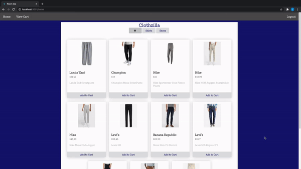
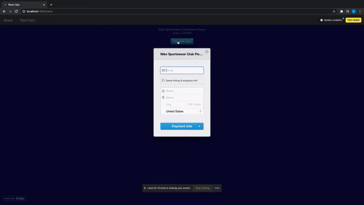

### **Clothzilla - Client** 

Front-end for Clothzilla, an ecommerce app integrated with Stripe Payment Processing.
Built with a React front end and Ruby on Rails back end. Styling was done with Semantic UI and Custom CSS.

Log-in Credentials for Website  
Username: cm11  
Password: 123  

[Back End](https://github.com/cmur11/apartmentreview_backend)

To use, fork and clonethis repository, & start api server and run:

-npm install && npm start

### **Features** 
Browse clothing by product type 
Add and remove items to cart 
Payment Processing with Stripe 

### Stripe Payment Confirmation
 

